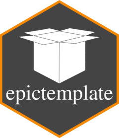

<!-- README.md is generated from README.Rmd. Please edit that file -->

```{r, include = FALSE}
knitr::opts_chunk$set(
  collapse = TRUE,
  comment = "#>",
  fig.path = "man/figures/README-",
  out.width = "100%"
)
```

[](https://github.com/forsterepi/epictemplate/actions/workflows/R-CMD-check.yaml)

# epictemplate 

`epictemplate` provides a template for creating new projects. It can be accessed via the **"New Project..." Wizard in RStudio**. Just install the package (see below for instructions) and re-open RStudio. The template is now available in the Wizard without the need to load the package, similar to e.g., `shiny`.

### Concept

The template makes it easy to use a "**few-click code structure**". The basic idea is that all code should be written to run automatically from start to finish with the single click of a button, e.g., the `source` button. This would be a "one-click code structure". However, there might be situations, in which "one-click" makes no sense. Consider an analysis for which you run multiple imputation and analyse the imputed datasets. Multiple imputation often takes a long time to run and, therefore, you do not want to repeat it every time you run your code. The solution is to split the code in 2 parts: the first one runs the imputation and ends with saving the imputed datasets; the second on runs the analysis and starts with loading the imputed datasets.

To achive a "few-click code structure", the code is **structured hierarchically** in the following levels:

-   Workflow: A workflow is comparable to the contents of a book. It describes the "chapters" of your code and calls the corresponding scripts. Running the workflow runs your complete analysis.
-   Subworkflow: In case a "chapter" is very long, use a subworkflow to include "subchapters". This is usually not necessary, though.
-   Script: Scripts contain the actual code. Put code that belongs together thematically into one script or create one script per "chapter".
-   Functions: Write your own functions to outsource code you use repeatedly in your scripts.

### Naming conventions

-   All names consist only of lower case letters, numbers, and underscores. Everything should be in English.
-   Names are given in a way that the .R files are automatically ordered in a hierarchical structure.
-   Workflow: `workflow_[workflow name].R` (e.g., `workflow_model.R` for the workflow that creates the model)
-   Script: `[workflow name]_[chapter number]_[if necessary, script number within chapter]_[script name].R` (e.g., `model_1_1_scc_bin.R` for a script in the workflow "model" which is used in "chapter 1" of the workflow and which is the first script to be sourced in "chapter 1" and has the name "scc_bin")
-   Subworkflow: `[workflow name]_[step number]_sub_[subworkflow name].R` (e.g., `model_2_sub_dag.R` for a subworkflow that creates DAGs)
-   Scripts in Subworkflows: `[workflow name]``_[chapter number]_``sub_[subworkflow name][subchapter number in subworkflow]_[if necessary, script number within subchapter]_[script name].R` (e.g., `model_2_sub_dag_1_2_create_dag.R` for a script in subworkflow "dag" which is used in "subchapter 1" of the subworkflow and which is the second script to be scourced in "subchapter 1" and has the name "create_dag")
-   Functions: `[Function name].R` (e.g., `fun_example.R` for function `fun_example()`)

### Options

In the "New Project..." Wizard in RStudio, you can customise your project with the following options:

-   **Use Stan?** (Checkbox): If selected includes a folder "Stan" for `.stan` files and additionally loads packages `cmdstanr`, `bayesplot`, and `posterior`.

### Template

The created project includes the following folders and files:

-   `Functions` (folder): Contains .R files of user-defined functions.
-   `Input` (folder): Contains data and other inputs loaded in the project.
-   `Output` (folder): Contains output saved in the project, e.g., plots and tables.
-   `R` (folder): Contains .R files of scripts and subworkflows. Workflows do not go into a folder.
    -   `0_packages.R`: Loads packages. Package `conflicted` is used to solve conflicts due to multiple functions from different packages having the same name.
    -   `0_functions.R`: Loads all user-defined functions in folder `Functions`.
-   `Stan` (folder): Contains .stan files. (See Options)
-   `Templates` (folder): Contains template .R files for the 4 levels of the code hierarchie. One way of using the templates is: In the "Files" pane in RStudio, check the box in front of the template you want to use, click on "More" and select "Copy To...".
    -   `template_fun.R`: Template for user-defined functions
    -   `template_script.R`: Template for scripts
    -   `template_subworkflow.R`: Template for subworkflows
    -   `template_workflow.R`: Template for workflows
-   `workflow_main.R`: A default workflow file. If you need multiple workflows, change the name from "main" to whatever you need.
-   `.lintr`: Default specifications for static code analysis, i.e., checking code without running it, using `lintr`. For using `lintr`, install the package and use "Addins/Lint current file" in RStudio or `lint()` you check the active file, or `lint_dir()` to check the whole project.

## Installation

You can install epictemplate from [GitHub](https://github.com/) with:

``` r
# install.packages("pak")
pak::pak("forsterepi/epictemplate")
```
