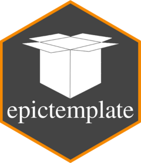

<!-- README.md is generated from README.Rmd. Please edit that file -->

[](https://github.com/forsterepi/epictemplate/actions/workflows/R-CMD-check.yaml)

# epictemplate 

`epictemplate` provides a template for creating new projects. It can be
accessed via the **“New Project…” Wizard in RStudio**. Just install the
package (see below for instructions) and re-open RStudio. The template
is now available in the Wizard without the need to load the package,
similar to e.g., `shiny`.

### Options

In the “New Project…” Wizard in RStudio, you can customise your project
with the following options:

- **Use Stan?** (Checkbox): If selected includes a folder “Stan” for
  `.stan` files and additionally loads packages `cmdstanr`, `bayesplot`,
  and `posterior`.

### Template

The created project includes the following folders and files:

- `Input` (folder): Contains data and other inputs loaded in the
  project.
- `Output` (folder): Contains output saved in the project, e.g., plots
  and tables.
- `R` (folder): Contains .R files of scripts and subworkflows. Workflows
  do not go into a folder.
  - `0_init.R`: Loads packages, solves conflicts with package
    `conflicted`, loads options, and initialises the cache.
- `Stan` (folder): Contains .stan files. (See Options)
- `report.qmd`: A quarto file containing the basic project structure:
  “Pre-data” describes tasks prior to using data, especially simulation,
  “Data” describes processing of data, “Post-data” describes data
  analysis.
- `.lintr`: Default specifications for static code analysis, i.e.,
  checking code without running it, using `lintr`. For using `lintr`,
  install the package and use “Addins/Lint current file” in RStudio or
  `lint()` you check the active file, or `lint_dir()` to check the whole
  project.

## New file

Create a new script with function `new_file()`, which is also accessible
via a RStudio Addin. Simply follow the instructions in the dialog boxes.

## Installation

You can install epictemplate from [GitHub](https://github.com/) with:

``` r
# install.packages("pak")
pak::pak("forsterepi/epictemplate")
```
